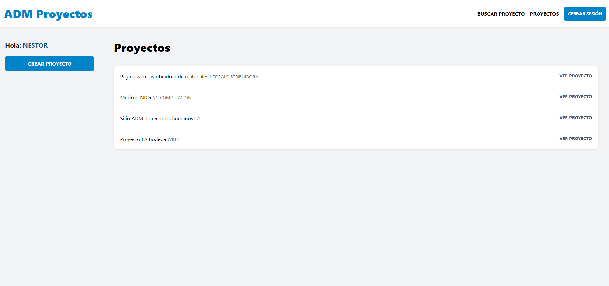
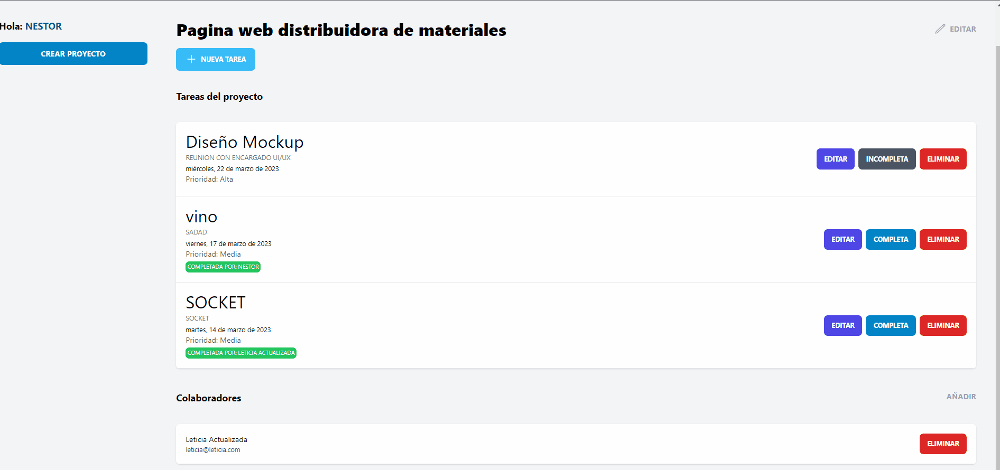
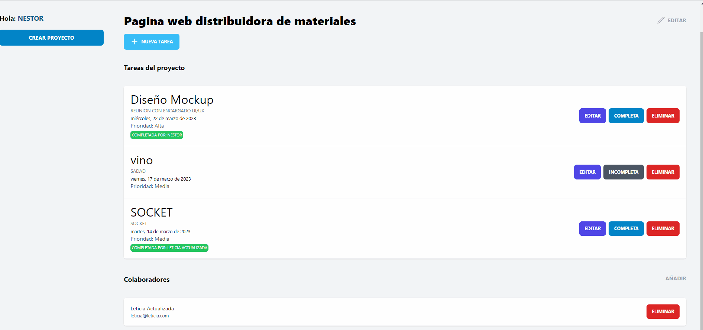
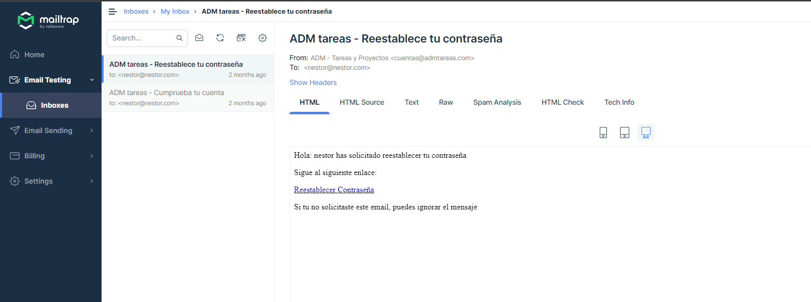

## Proyectos para administracion de proyectos

Deploy del sitio: [DATA-SEND](https://leafy-alfajores-9590cf.netlify.app)

### Frontend realizado con [VITE.js](https://nextjs.org/)

### Backend con [NODE.js](https://nodejs.org/en) y [MongoDB](https://www.mongodb.com/).

[Repositorio Backend](https://github.com/NestorDanielGomez/Backend-Mern-Adm-Proyectos)

El usuario se autenticar mediante correo electronico, al igual que el cambio de contraseña. Se utiliza mailtrap para autenticar el usuario.

usuario autenticado para probar el proyecto:
`usuario: nestor@nestor123 `
`contraseña: nestor123`

El usuario autenticado, puede crear/editar proyectos.
El usuario autenticado, puede crear/editar tareas.
El usuario autenticado, puede agregar/eliminar colaboradores del proyecto.
El usuario registrado pero no autenticado solo pueder completar las tareas en las que esta participando

Dependencias utilizadas

- [axios](https://www.npmjs.com/package/axios)
- [socket.io-client](https://www.npmjs.com/package/socket.io-client)

Framework CSS:

- [tailwindcss](https://tailwindcss.com/docs/installation)

